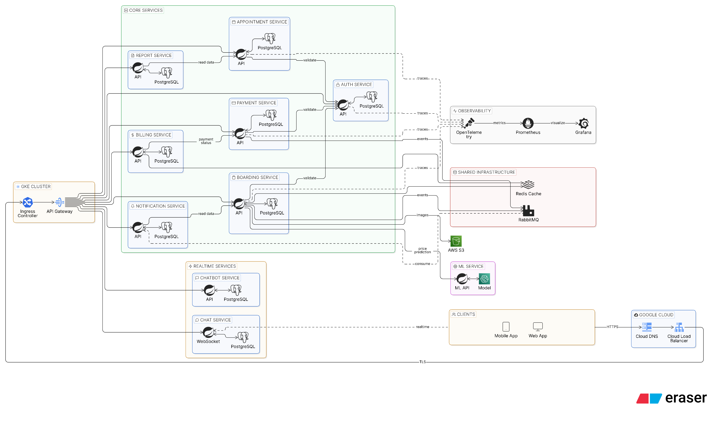
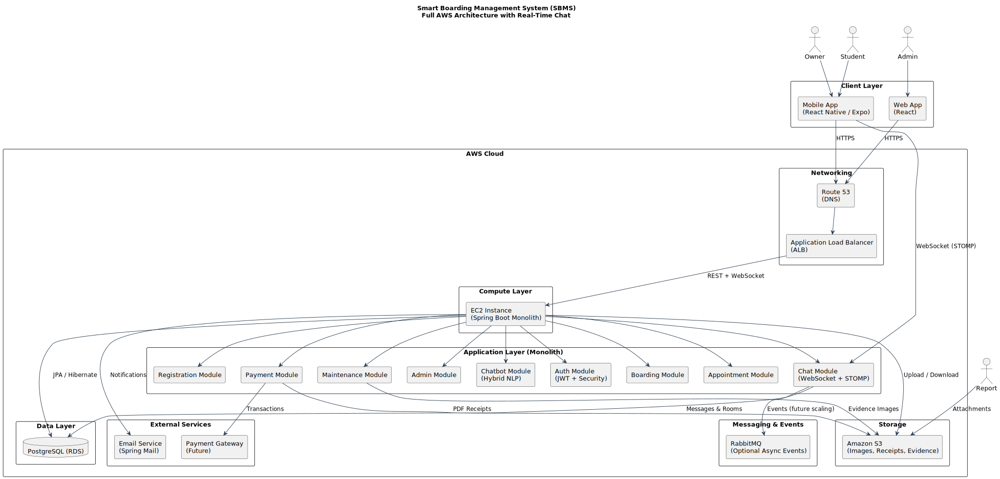
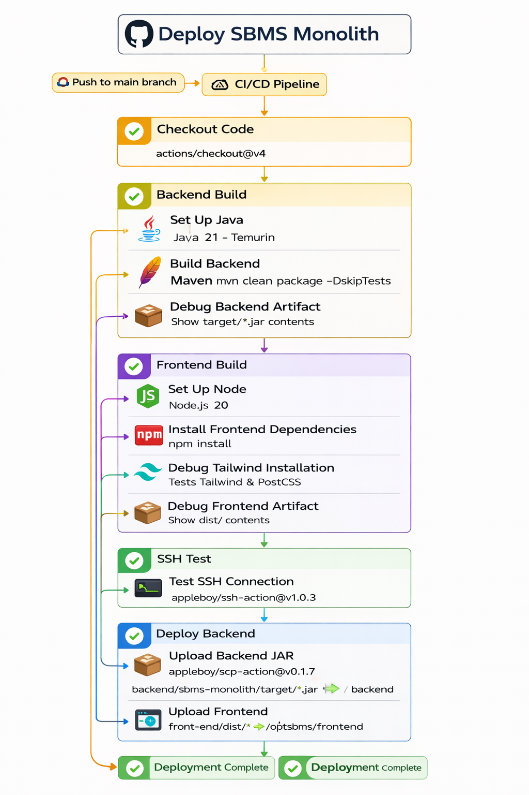
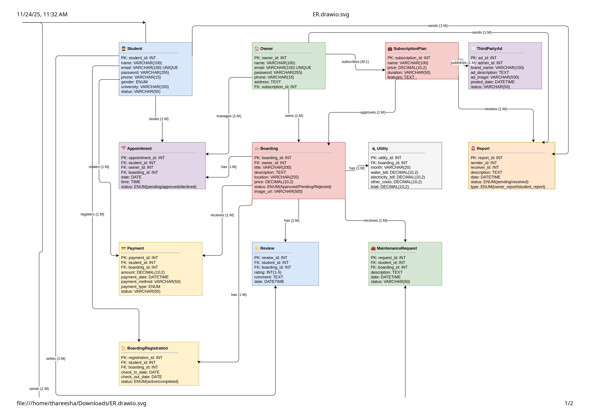
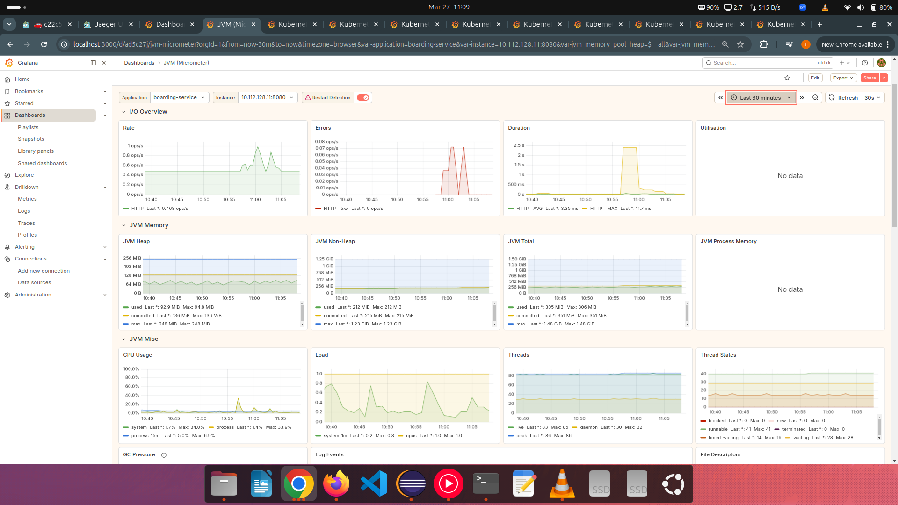
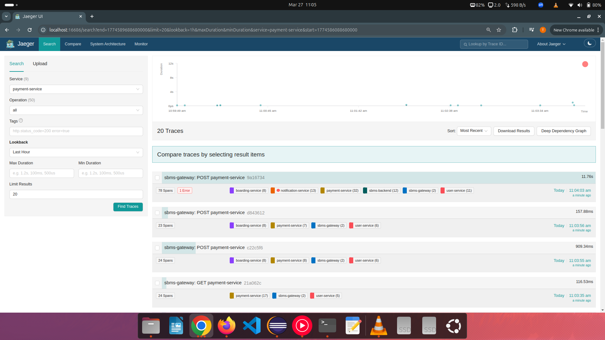
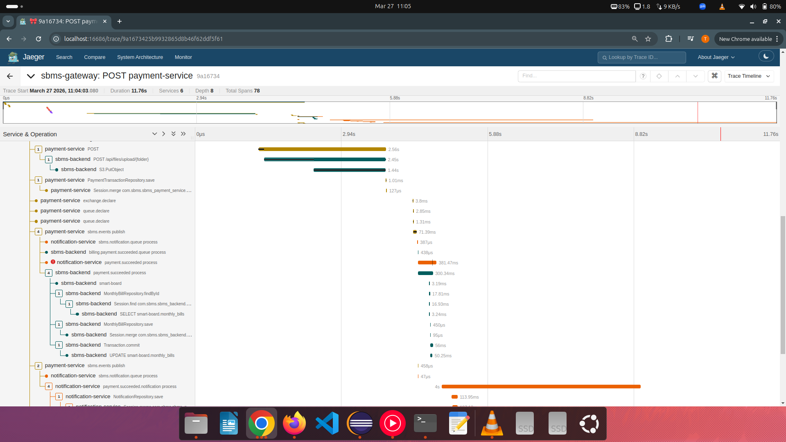
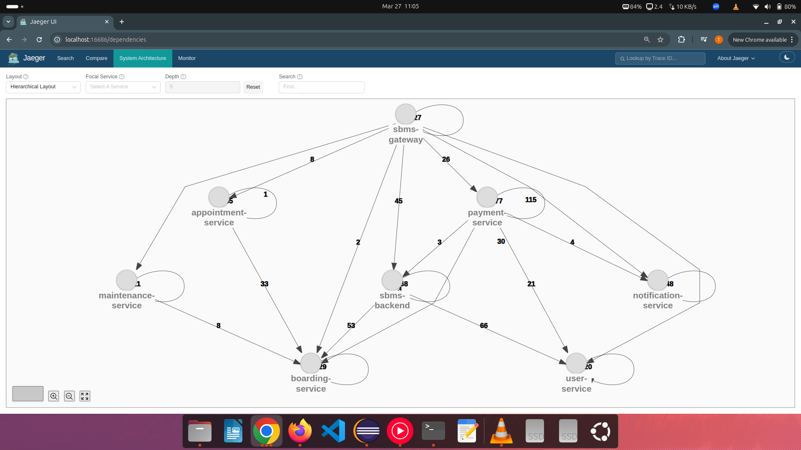

# 🏠 Smart Boarding Management System (SBMS)

> 🚀 A Cloud-Native Microservices Platform for Boarding Management

---

## 📌 Overview

The Smart Boarding Management System (SBMS) is a full-stack, cloud-native platform designed to modernize and digitize the boarding ecosystem for students and property owners.

It provides a centralized system for:

- Boarding discovery & booking  
- Payment & billing automation  
- Maintenance management  
- Admin analytics & monitoring  

---

## 🎯 Problem Statement

Traditional boarding systems suffer from:

- Unverified listings  
- Manual booking processes  
- No structured billing system  
- Poor communication between tenants & owners  
- Lack of system monitoring  

SBMS solves these problems using a scalable microservices architecture.

---

## 🧠 Key Features

### Student (Boarder)
- Search & filter boarding listings  
- Book visiting appointments  
- Register for boarding  
- Online payments & billing  
- Submit maintenance requests  
- Add reviews & ratings  
- Emergency alert system  

### Boarding Owner
- Publish & manage advertisements  
- Accept/reject appointments  
- Add utility costs  
- Boost ads via payments  
- Assign technicians  
- Manage tenants  

### Technician
- Receive maintenance tasks  
- Update repair status  
- Manage profile & ratings  

### Admin
- Approve/reject boarding ads  
- Manage users  
- Review reports  
- View analytics dashboards  
- Publish third-party ads  

---

## 🏗️ System Architecture

### Microservices Architecture

```
Frontend (React / React Native)
        ↓
API Gateway (Spring Cloud Gateway)
        ↓
--------------------------------------------------
| User Service        | Payment Service           |
| Boarding Service    | Notification Service      |
| Maintenance Service | ML Service                |
--------------------------------------------------
        ↓
PostgreSQL + Redis + Blockchain Storage
```

---

## ☁️ Cloud & Deployment

### DevOps Pipeline

- GitHub Actions (CI/CD)  
- Docker (Containerization)  
- Kubernetes (Orchestration)  
- API Gateway / Ingress (Routing)  

### Deployment Flow

```
Code → Build → Test → Docker Image → Registry → Kubernetes Deploy
```

---

## ⚙️ Tech Stack

### Frontend
- React.js  
- React Native  

### Backend
- Spring Boot  
- Spring Cloud  
- Spring Security (JWT)  

### Database
- PostgreSQL  
- Redis  

### DevOps & Cloud
- Docker  
- Kubernetes  
- AWS S3  
- GitHub Actions  

### Monitoring
- Prometheus  
- Grafana  
- OpenTelemetry  
- Jaeger  

---

## 🔐 Security

- JWT Authentication  
- Role-Based Access Control  
- BCrypt Password Hashing  
- API Rate Limiting  
- HTTPS Encryption  

---

## 📁 Project Structure

```
sbms/
├── frontend/
├── mobile-app/
├── api-gateway/
├── services/
├── k8s/
├── docker/
└── docs/
```

---

## 🚀 Setup

### Backend

```
cd user-service
mvn spring-boot:run
```

### Frontend

```
cd frontend
npm install
npm start
```

---

## 📈 Future Improvements

- Mobile App Expansion  
- AI Recommendations   
- Multi-language Support  

---

## 👥 Team

- Thareesha  
- Themiya
- Dhananjaya
- Dinuka
- Sandun

Supervisor: Dr. K.D.C.G Kapugama  

---


## 🔗 Related Repositories

This project is part of a larger system:


- ⚙️  Microservices Repository  
  👉 https://github.com/Thareesha98/smart-board-microservices

- 📱 Mobile App (React Native)  
  👉 https://github.com/Thareesha98/smart-board-mobile-app

## ⭐ Final Note

This project demonstrates a real-world cloud-native microservices architecture with scalability and observability.


---

## 📸 System Visualization

### 🏗️ Microservices Architecture


### 🏗️ Monolithic Architecture


### 🔄 CI/CD Pipeline


### 🗄️ ER Diagram


### 📊 Grafana Dashboard


### 🔍 Distributed Tracing (OpenTelemetry)



